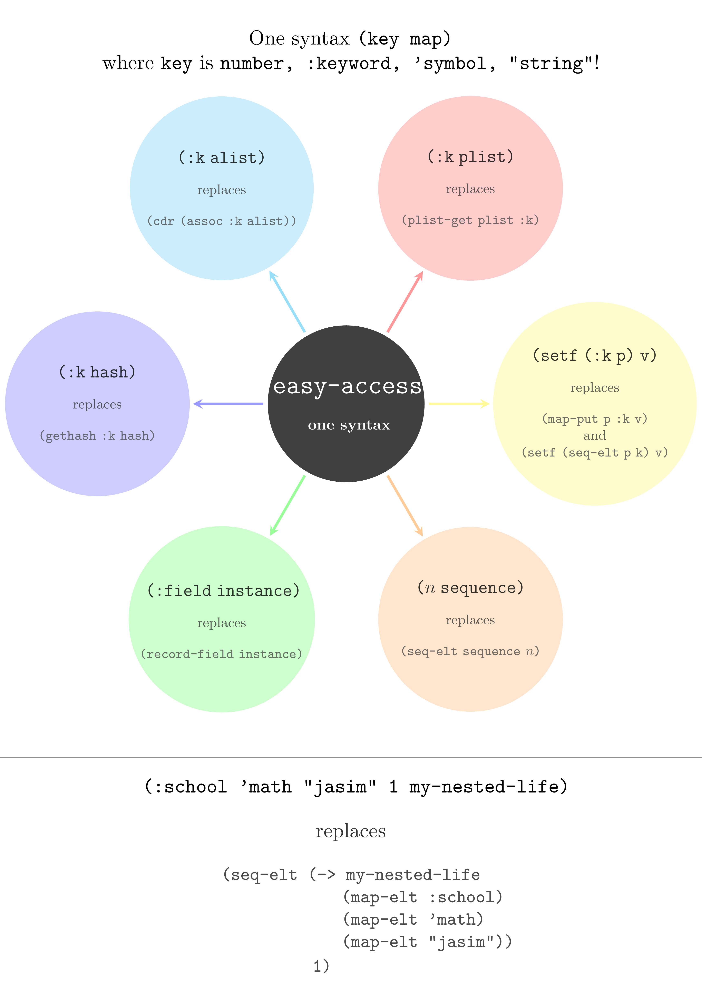

#+TITLE: easy-access — Clojure-style accessors for Emacs Lisp
#+AUTHOR: Musa Al-hassy
#+OPTIONS: toc:2
 
# Render diagram: (progn (use-package ob-latex-as-png :ensure t)
#                        (add-hook 'org-babel-after-execute-hook 'org-redisplay-inline-images))
#+begin_src latex-as-png :file easy-access-overview.png :resolution "720" :results raw value replace :exports results
\usepackage{smartdiagram}
\usepackage{graphicx}
% in 
\vspace{1.5em}
\centering{One syntax \texttt{(key map)} \\ where \texttt{key} is \texttt{number, :keyword, 'symbol, "string"}!}

\vspace{1em}
\smartdiagramset{
  planet color=black!75,
  planet size=3.5cm,
  planet font=\normalfont\bfseries\normalsize,
  satellite size=3.6cm,
  satellite font=\normalfont\small,
  satellite text width=3.5cm,
  distance planet-satellite=5.7cm,
  connection color=gray!60,
  connection line width=0.06cm,
  text color=black,
  font=\small\sffamily
}
\newcommand{\new}[1]{{\large \texttt{\mbox{#1}}}}
\newcommand{\replaces}{\\[1em]\textcolor{black!80}{replaces}\vspace{0em}}
\newcommand{\andAlso}{\\\textcolor{black!80}{and}\vspace{-1em}}
\newcommand{\old}[1]{\\[1em]\textcolor{black!70}{\texttt{\mbox{#1}}}}
\resizebox{1.0\textwidth}{!}{%
\smartdiagram[constellation diagram]{%
  {\color{white}\mbox{\hspace{-2em}\LARGE\texttt{easy-access.el}}\\[1em]\mbox{one syntax}},
  \new{(:k plist)} \replaces \old{(plist-get plist :k)},
  \new{(:k alist)} \replaces \old{(cdr (assoc :k alist))},
  \new{(:k hash)} \replaces \old{(gethash :k hash)},
  \new{(:field instance)} \replaces \old{\hspace{-.4em}(record-field instance)},
  \new{($n$ sequence)} \replaces \old{(seq-elt sequence $n$)},
  % \new{(N xs)} \replaces \old{Inconsistent arg order!}\vspace{-1em}\old{(nth N xs)}\andAlso{}\old{(aref xs N)},a
  % \new{(setf (:k m) v)} \old{Inconsistent arg order!}\vspace{-1em}\old{(plist-put m :k v)}\vspace{-1em}\old{(puthash :k v m)}
  \new{(setf (:k p) v)} \replaces \old{(map-put p :k v)}\andAlso{}\old{(setf (seq-elt p k) v)}
}} % end \resizebox + \smartdiagram

\vspace{1em}
{\textcolor{black!44} \hrule}
\vspace{1em}

\centering{\texttt{ (:school 'math "jasim" 1 my-nested-life) }}
\\[1em] \textcolor{black!80}{replaces}
\\[1em] {\small \textcolor{black!70}{\texttt{(seq-elt (->  my-nested-life
      \\ \hspace{7em} (map-elt :school)
      \\ \hspace{6em} (map-elt 'math)
      \\ \hspace{7.5em} (map-elt "jasim"))
      \\ \hspace{-3em}1)}}}
% \vspace{1em}
\\{\color{white} Bye!}
#+end_src

#+RESULTS:

#+html: 

#+html:   <a href="https://github.com/alhassy/easy-access/actions?query=workflow%3A%22easy-access+CI%22">
#+html:     
#+html:   </a>
#+html: 

:Complicated_threading: 
#+begin_src emacs-lisp
(equal
 (:school 'math "jasim" 1 (alist :school (list 'math (hash-map "jasim" [a b]))))
 (seq-elt (-> (alist :school (list 'math (hash-map "jasim" [a b])))
             (map-elt :school)
             (map-elt 'math)
             (map-elt "jasim")
             )
          1)) 
#+end_src
:End:
 
#+begin_comment tldr
 What works:
  - (:key plist) — plist lookup
  - ('sym plist) — plain-symbol plist lookup (symbol-plist etc.)
  - (:key alist) / ('sym alist) — alist lookup (CAR-is-a-cons heuristic)
  - ("str" alist) / ("str" plist) / ("str" hash) — string-keyed lookup (equal)
  - (:field struct) / ('field struct) — struct slot access (memoised)
  - (:key hash-table) / ('sym hash-table) — gethash fallback
  - (N seq) — nth/elt into lists, vectors, strings; negative N counts
    from the end; (-1 xs) = last element; out-of-bounds reads return nil
  - (N hash) / (N alist) — integer keys on hash-tables and alists work
    exactly like keyword keys: gethash / assq+cdr, fully setf-able
  - (:a 'b N "str" obj) — left-to-right chained access, arbitrary depth,
    freely mixing key shapes and crossing container types
  - C-x C-e, C-M-x, M-: on bare accessor forms
  - File loading via load, load-file, require
  - Threading macros (thread-first, thread-last, ->, ->>) — accessor
    forms inside their bodies are rewritten after macro-expansion
  - setf on accessor forms — dispatches by type (plist-put, setcdr on
    alist pair, struct-slot setf, puthash, aset, splice via setcar+nthcdr)
  - Mode toggle cleanly installs and uninstalls all hooks
  - Byte-compilation of walked forms
  - defcall — user-extensible CAR-shape dispatch: the four built-in
    rules (integers, keywords, quoted-symbols, strings) are themselves
    defcall forms; new shapes (characters, …) are declared in a single
    form without touching the walker
  - 120 of 120 tests passing, zero byte-compile warnings
#+end_comment

* What & Why

We bring [[https://alhassy.com/ClojureCheatSheet/CheatSheet.pdf][Clojure]]'s terse accessor syntax to Emacs Lisp.  Concretely — where
we once wrote ~(plist-get user :name)~, we now write ~(:name user)~; where
we wrote ~(nth 3 seq)~, we write ~(3 seq)~; where we had a struct like
~(cl-defstruct pair first second)~ and wrote ~(pair-first p)~, we write
~(:first p)~.

The savings compound.  A deeply-nested access that used to look like

#+begin_src emacs-lisp
  (plist-get (nth 3 (plist-get obj :children)) :label)
#+end_src

becomes, in due time,

#+begin_src emacs-lisp
  (:children 3 :label obj)
#+end_src

Path-first, left-to-right — /:children/, then /3rd/, then /:label/ —
same reading order as Clojure's ~get-in~ and ~->~.

* One syntax, every container

Emacs Lisp ships a different accessor for every container type — and a
different setter beside it.  ~plist-get~ for plists, ~assq~ + ~cdr~ for
alists, ~nth~ for lists, ~elt~ or ~aref~ for vectors and strings,
~gethash~ for hash tables, a generated ~struct-field~ function for every
~cl-defstruct~.  On the write side, a parallel menagerie — ~plist-put~,
~setcdr~, ~setcar~ + ~nthcdr~, ~aset~, ~puthash~, ~setf~ of
~cl-struct-slot-value~.  /Fourteen functions to remember/, and the choice
depends on the container — which the reader has to carry in their head.

~easy-access~ collapses the table:

| Container          | Stock /get/                  | Stock /set/                    | ~easy-access~  |
|--------------------+------------------------------+--------------------------------+----------------|
| Plist              | ~(plist-get p :k)~           | ~(setq p (plist-put p :k v))~  | ~(:k p)~       |
| Alist              | ~(cdr (assq :k a))~          | ~(setcdr (assq :k a) v)~       | ~(:k a)~       |
| Hash table         | ~(gethash :k h)~             | ~(puthash :k v h)~             | ~(:k h)~       |
| ~cl-defstruct~     | ~(point-label p)~            | ~(setf (point-label p) v)~     | ~(:label p)~   |
| ~symbol-plist~     | ~(get 'x 'custom-group)~     | ~(put 'x 'custom-group v)~     | ~('custom-group (symbol-plist 'x))~ |
| List (by index)    | ~(nth 2 xs)~                 | ~(setcar (nthcdr 2 xs) v)~     | ~(2 xs)~       |
| Vector (by index)  | ~(aref v 2)~                 | ~(aset v 2 val)~               | ~(2 v)~        |
| String (by index)  | ~(aref s 2)~                 | —                              | ~(2 s)~        |
| Hash (integer key) | ~(gethash 2 h)~              | ~(puthash 2 v h)~              | ~(2 h)~        |
| Alist (integer key)| ~(cdr (assq 2 a))~           | ~(setcdr (assq 2 a) v)~        | ~(2 a)~        |
| Alist (string key) | ~(cdr (assoc "k" a))~        | ~(setcdr (assoc "k" a) v)~     | ~("k" a)~      |
| Plist (string key) | ~(plist-get p "k" #'equal)~  | ~(plist-put p "k" v #'equal)~  | ~("k" p)~      |
| Hash (string key)  | ~(gethash "k" h)~            | ~(puthash "k" v h)~            | ~("k" h)~      |

/One/ reader: ~(:k obj)~, ~(N obj)~, or ~("k" obj)~.
/One/ writer: ~(setf (:k obj) v)~, ~(setf (N obj) v)~, or ~(setf ("k" obj) v)~.

Dispatch happens at runtime, so the /same/ path expression works across
heterogeneous nested structures — a vector inside an alist inside a list:

#+begin_src emacs-lisp
  (let ((db (list '((:users . ["Ali" "Hassan" "Hussain"])))))
    (0 :users 0 db))               ;; ⟹ "Ali"
#+end_src

Refactoring a field from plist to struct, or alist to hash table, no
longer rewrites every call site — the accessor syntax is identical.
The container is an /implementation detail/; the access pattern is the
/interface/.

When the key is runtime-computed — a variable, an ~(intern …)~, a
~(match-string …)~ — the literal reader syntax no longer applies (the
walker cannot tell ~(var obj)~ apart from an ordinary function call).
For that case we provide the explicit ~easy-access~ macro, which is
the /same/ uniform form for runtime keys:

#+begin_src emacs-lisp
  (easy-access KEY     obj)      ;; replaces plist-get / alist-get / gethash / aref / …
  (easy-access K0 K1 … obj)      ;; chained, left-to-right
  (setf (easy-access KEY obj) v) ;; writes dispatch just like reads
#+end_src

Details — including why we don't extend the walker to handle variable
keys automatically — live under /Variable keys — the ~easy-access~
macro/ below.

* Installation

#+begin_src emacs-lisp
  (add-to-list 'load-path "~/easy-access/")
  (require 'easy-access)
  (easy-access-mode 1)
#+end_src

Place this /before/ any configuration that uses the new syntax.  The mode
is global — there is no per-buffer variant — because the extension changes
how Emacs /reads/ and /evaluates/ Lisp everywhere.

To disable:

#+begin_src emacs-lisp
  (easy-access-mode -1)
#+end_src

* Usage Examples

** Plists

#+begin_src emacs-lisp
  (let ((user (list :name "Ali" :age 42 :city "Kufa")))
    (:name user))    ;; ⟹ "Ali"
#+end_src

Equivalent to ~(plist-get user :name)~.

** Sequences — lists, vectors, strings

An integer in function position is an index into any Emacs sequence —
dispatched to ~nth~ for lists and ~elt~ for vectors and strings:

#+begin_src emacs-lisp
  (2 (list 10 20 30 40 50))       ;; ⟹ 30   -- list, via nth
  (0 '(first second third))        ;; ⟹ first

  (2 [10 20 30 40 50])             ;; ⟹ 30   -- vector, via elt
  (1 ["alpha" "beta" "gamma"])     ;; ⟹ "beta"

  (0 "Hussain")                    ;; ⟹ ?H   -- string, elt returns char
  (3 "Salam")                      ;; ⟹ ?a
#+end_src

*** Negative indices count from the end

In similar spirit to Python slicing, a negative index reads from the
tail — ~-1~ is the last element, ~-2~ the second-to-last, and so on.
Applies uniformly to lists, vectors, and strings, for both reads and
~setf~ writes:

#+begin_src emacs-lisp
  (-1 [a b c])                    ;; ⟹ c
  (-2 "abc")                      ;; ⟹ ?b     (the character b)
  (-1 '(first second third))      ;; ⟹ third

  (defvar my-vec (vector 10 20 30))
  (setf (-1 my-vec) 99)            ;; writes to the last slot
  my-vec                           ;; ⟹ [10 20 99]
#+end_src

This means ~(-1 xs)~ replaces both dash's ~(-last-item xs)~ and stock
Elisp's ~(car (last xs))~ — one fewer function to remember.

*** Replacing ~car~ / ~cadr~ / ~nth~

Integer accessors dispatch to ~nth~, so ~(N xs)~ ≡ ~(nth N xs)~:

- ~(car xs)~ ≡ ~(0 xs)~
- ~(cadr xs)~ ≡ ~(nth 1 xs)~ ≡ ~(1 xs)~
- ~(caddr xs)~ ≡ ~(nth 2 xs)~ ≡ ~(2 xs)~
- ~(caar xs)~ ≡ ~(car (car xs))~ ≡ ~(0 0 xs)~

Note that ~cdr~ has no single-integer equivalent: ~(cdr xs)~ returns the
tail (a list), while ~(1 xs)~ returns the second /element/.  Chained
~c*r~ forms that only use ~car~ (like ~caar~) decompose into nested
~0~'s, but mixed ~car~/~cdr~ towers like ~(cadar x)~ don't reduce
further — use ~nth~ or destructuring instead.

*** DIY Example:: Python-style splicing via keyword syntax

[[https://alhassy.com/PythonCheatSheet/CheatSheet.pdf][Python]] ships with terse slice notation.  We can approximate it in Emacs Lisp
/without/ touching the walker, because colon introduces keywords and ~easy-access~
only rewrites /literals/ — so we can embed literal indices directly into a keyword
name.

Use ~:start:end:step~ to get every ~step~-th item from ~start~ up to ~end~ (inclusive), with
~-𝓃~ meaning the 𝓃-th item from the end:
#+begin_src emacs-lisp
(:1:-2 "hello, world")                  ;; ⇒ "ello, worl"
(:4:   "hello, world")                  ;; ⇒ "o, world", since :4: ≡ :4:-1:1
(:4:4: "hello, world")                  ;; ⇒ "o"
(:0:6:2 [h₀ e₁ l₂ l₃ o₄ w₅ o₆ r₇ l₈ d₉]) ;; ⇒  [h₀ l₂ o₄ o₆]
(:3:7 '(h₀ e₁ l₂ l₃ o₄ w₅ o₆ r₇ l₈ d₉))  ;; ⇒ '(l₃ o₄ w₅ o₆ r₇)
(:::3 '(h₀ e₁ l₂ l₃ o₄ w₅ o₆ r₇ l₈ d₉))  ;; ⇒ '(h₀ l₃ o₆ d₉), since :::3 ≡ :0:-1:3
(:1:-1 1234)                            ;; ⇒ ERROR: Whoa buddo, splicing “(:1:-1 1234)” requires a sequence, not a “integer”!
#+end_src

A minimal implementation:
#+begin_src emacs-lisp
(defcall keyword-splice (slice sequence &optional _value)
  :when (and (keywordp slice)
             (string-match "^:\\(-?[0-9]*\\):\\(-?[0-9]*\\)\\(:\\([0-9]*\\)\\)?$"
                           (symbol-name slice)))
  "`:start:end:step' in CAR position slices SEQUENCE like in Python."
  (let* ((seq-type (--> (type-of sequence)
                        (cond ((equal it 'cons) 'list)
                              ((member it '(vector string list)) it)
                              (:otherwise (error "Whoa buddo, splicing “(%s %s)” requires a sequence, not a “%s”!"
                                                 slice sequence it)))))
         (max-len (length sequence)) ;; Could crash without the previous type-checking!
         (start   (string-to-number (match-string 1 (symbol-name slice))))
         (end (--> (match-string 2 (symbol-name slice))
                   (if (string= it "") "-1" it)                           ;; slice  =  :start:
                   (string-to-number it)
                   (if (< it 0) (+ max-len it) it)))
         (step  (--> (match-string 4 (symbol-name slice))
                     (cond ((not it) 1)                                   ;; slice  =  :start:end
                           ((string= it "") 1)                            ;; slice  =  :start:end:
                           (:otherwise (max 1 (string-to-number it))))))) ;; slice  =  :start:end:step 
    ;; (message-box "%s" (list :max-len max-len :start start :end end :step step)) ;; DEBUGGING
    ;; The seq-into call is to ensure we extract subvectors/substrings/sub-X from vectors/strings/X, respectively.    
    (seq-into (cl-loop for i from start to end by step collect (seq-elt sequence i)) seq-type)))
#+end_src

The key insight: The indices are /literals baked into the keyword name/, so the
walker sees a plain keyword in CAR position — no new special-form handling
needed.

The same trick generalises to any literal syntax you'd like to smuggle in.
Provided you're working with literals, the approach lets you introduce terse
domain notation in a single ~defcall~ form — no changes to the walker or the
runtime dispatcher.

*** Out-of-bounds reads return ~nil~

Out-of-bounds integer reads — positive or negative — yield ~nil~
uniformly across lists, vectors, and strings.  This matches ~nth~'s
lenient semantics rather than ~elt~'s ~args-out-of-range~ signal, and
lets the same accessor form safely probe sequences of unknown length:

#+begin_src emacs-lisp
  (99 '(a b c))                   ;; ⟹ nil
  (99 [a b c])                    ;; ⟹ nil     -- not an error
  (99 "abc")                      ;; ⟹ nil
  (-99 [a b c])                   ;; ⟹ nil     -- negative out-of-bounds too
#+end_src

Writes past the end still error — clobbering a non-existent index has
no sensible meaning.

** Plain-symbol keys — ~symbol-plist~ and friends

Emacs's property lists on symbols — the ones returned by
~symbol-plist~ — are keyed by /bare/ symbols, not keywords.  Alists
and hash-tables keyed by plain symbols are also pervasive.  Write a
/quoted/ symbol in accessor position:

#+begin_src emacs-lisp
  (put 'x 'custom-group '((some stuff)))
  (put 'x 'slot-name t)

  ('custom-group (symbol-plist 'x))     ;; ⟹ ((some stuff))
  ('slot-name   (symbol-plist 'x))      ;; ⟹ t

  (let ((user '((name . "Ali") (age . 42))))
    ('name user))                       ;; ⟹ "Ali"
#+end_src

The quote is part of the /surface syntax/ — ~'custom-group~ is
~(quote custom-group)~, and the walker recognises that shape in
function position as a symbol-key accessor.  Without it, a bare
symbol in function position would be ambiguous with an ordinary
function call.

Why this is safe: in pre-24 dynamic-binding Elisp, ~((quote f) arg)~
used to funcall ~f~ on ~arg~ — that idiom is rejected outright by
modern lexical-binding Elisp, so claiming the shape as an accessor
is additive in practice.

** Hash tables

Keyword keys on a hash-table fall through to ~gethash~:

#+begin_src emacs-lisp
  (let ((h (make-hash-table :test 'equal)))
    (puthash :name "Ali" h)
    (puthash :role "successor" h)
    (:name h))                     ;; ⟹ "Ali"
#+end_src

** Alists

Alists are common in Emacs (auth sources, file-local variables, ~org-capture-templates~, …).
~easy-access~ distinguishes them from plists by shape — the first element is
a /cons cell/, not a bare keyword — and dispatches to ~assq~ + ~cdr~:

#+begin_src emacs-lisp
  (let ((user '((:name . "Fatima") (:age . 28) (:city . "Madinah"))))
    (:name user))                  ;; ⟹ "Fatima"

  ;; Plists and alists coexist — the runtime dispatcher picks the right tool:
  (:name (list :name "plist-shape"))                  ;; ⟹ "plist-shape"
  (:name (list (cons :name "alist-shape")))           ;; ⟹ "alist-shape"
#+end_src

Equivalent to ~(cdr (assq :name user))~.

*** Alists vs. hash tables — different critters

A natural question: Why use alists when hash tables exist?  Performance
differences exist, but they rarely matter at Emacs scales.  The real answer is
that they are /not the same kind of thing/.

Go back to set theory: A function is a relation — a set of ordered pairs
~(input, output)~ with no input appearing twice.  An alist is almost a
direct encoding of that: A list of ~(key . value)~ cons cells.  The
connection to ordinary list operations is not incidental — it is the
point.  Everything you can do with a Lisp list you can do with an alist:
~mapcar~, ~cl-remove-if~, ~seq-filter~, structural sharing via ~cons~,
pattern-matching with ~pcase~.  None of that applies to a hash table,
which is /only/ a map — a self-contained object with one comparison
predicate and one value per key, full stop.

This buys alists things hash tables cannot offer:

- *Multimaps.* The same key may appear multiple times; ~assq~ finds the
  first, but you can walk the whole list to collect all values.  An
  Elisp hash table realises a mathematical function — one key, one value.
- *Structural sharing.* ~(cons new-pair old-alist)~ creates a new "scope"
  in O(1) without copying — the standard trick behind dynamic binding and
  environment chains in interpreters.
- *List operations for free.* Sorting, filtering, grouping, zipping —
  the full ~seq~ / ~cl~ vocabulary applies directly.

So the gradient is: Reach for an alist when the structure /is/ a list
that you also want to look things up in.  Reach for a hash table when
you want /only/ a scalable map with a fixed comparison predicate and
O(1) amortised lookup.  ~easy-access~ makes the access syntax identical
either way, so the choice is purely about data-structure semantics —
not spelling.

#+begin_details "An exploration into performance wrt retrivals"
Checking how long it takes to access alists vs hashmaps? It seems 10+ items then
might as well use a hashmap!
#+begin_src emacs-lisp 
(require 'cl-lib)
(require 'map) ;; Emacs' built-in map.el

(defmacro benchmark (&rest body)
  "How long does it take to execute BODY?"
  (declare (indent 0))
  `(progn
     (garbage-collect)
     (let ((start (float-time)))
       ,@body
       (* 100000 (- (float-time) start)))))

(defun benchmark-random-sets-then-retrivals (size retrivals)
  "Create an alist and hash-map randomly of the given SIZE, then benchmark performing RETRIEVALS-many random accessors."
  (let ((alist ())
        (hash-map (make-hash-table :test 'eq)))

    ;; for every i:0..n, key = random,
    ;; Randomly populate the map “0..n → 0..n” where n = size. 
    (cl-loop for value from 0 to size
             for key = (cl-random size)
             do (progn (push (cons key value) alist)
                       (puthash key value hash-map)))

    ;; Now retrieve random elements from the maps; how long does that take?
    (cons
     (benchmark (cl-loop for key from 0 to retrivals
                         do (assq (% key size) alist)))
     (benchmark (cl-loop for key from 0 to retrivals
                         do (gethash (% key size) hash-map))))))

(progn (insert "Size Retrievals AList     HashMap")
       (cl-loop for size in '(1 10 30 100)
                do (insert "\n---------------------------------")
                (cl-loop for retrivals in '(1 10 30 100)
                         for result = (benchmark-random-sets-then-retrivals size retrivals)
                         do (insert (format "\n%-4d %-4d       %2f %2f" size retrivals (car result) (cdr result))))))

(when nil
  Size Retrievals AList     HashMap
  ---------------------------------
  1    1          0.500679 0.715256
  1    10         0.786781 0.691414
  1    30         0.810623 0.810623
  1    100        1.502037 1.597404
  --------------------------------- ;; ⟨ If you have at least 10 items, then hashmap is at least as good as alist if not better! ⟩
  10   1          0.405312 0.309944
  10   10         0.619888 0.691414 ;; ⇐ 😲 Roughly the same performance!
  10   30         1.287460 0.905991
  10   100        1.716614 1.597404
  --------------------------------- ;; ⟨ If you have 30+ items, just use hash-map! ⟩
  30   1          0.905991 0.500679
  30   10         1.001358 0.905991
  30   30         1.287460 1.001358
  30   100        2.098083 1.692772
  ---------------------------------
  100  1          0.810623 0.405312
  100  10         1.001358 0.691414
  100  30         1.311302 0.810623
  100  100        2.789497 2.002716
  ) 
#+end_src
#+end_details

** String keys

String literals in CAR position look up by ~equal~ association — the
common Emacs pattern ~(cdr (assoc "Authorization" headers))~ becomes
simply:

#+begin_src emacs-lisp
  (let ((headers '(("Authorization" . "Bearer tok")
                   ("Content-Type" . "application/json"))))
    ("Authorization" headers))       ;; ⟹ "Bearer tok"
#+end_src

Works on string-keyed plists too — stock Emacs 29+ supports
~(plist-get plist key #'equal)~, and easy-access dispatches to it
automatically:

#+begin_src emacs-lisp
  ("hello" '("hello" "world" "where" "here"))  ;; ⟹ "world"
#+end_src

And on ~equal~-test hash tables:

#+begin_src emacs-lisp
  (let ((h (make-hash-table :test 'equal)))
    (puthash "city" "Kufa" h)
    ("city" h))                      ;; ⟹ "Kufa"
#+end_src

The dispatcher distinguishes alists from plists by the same heuristic
used for keywords: if the first element of the list is a cons cell,
it is an alist (dispatched to ~assoc~); otherwise it is a plist
(dispatched to ~plist-get~ with ~#'equal~).  Both forms work:

#+begin_src emacs-lisp
  ;; Alist — CAR is a cons cell:
  ("hello" '(("hello" . "world")))   ;; ⟹ "world"
  ;; Plist — CAR is a string atom:
  ("hello" '("hello" "world"))       ;; ⟹ "world"
#+end_src

String keys participate in chained access just like keywords and
integers.  ~("admin" "users" db)~ first looks up ~"users"~ in ~db~,
then ~"admin"~ in the result — all left-to-right.

This is safe for the same reason keywords and integers are: a string
in function position is not valid Elisp — ~("foo" bar)~ signals
~invalid-function~ in stock Emacs, so claiming the shape as an accessor
is purely additive.

** Struct instances

#+begin_src emacs-lisp
  (cl-defstruct point x y label)
  (let ((p (make-point :x 1 :y 2 :label "origin")))
    (:label p))    ;; ⟹ "origin"
#+end_src

The accessor dispatches via the generated ~point-label~ function.
Struct-slot lookup is memoised, so repeated access is cheap.

*** Structs are just named plists — and alists and hash-tables are the same story

~easy-access~ blurs the distinction between all four associative
container types — they are accessed the exact same way and, with two
small helpers, built almost the same way too.  Define:

#+begin_src emacs-lisp
  (defun hash-map (&rest keys-and-values)
    "Create a hash-table from a plist of KEYS-AND-VALUES."
    (map-into keys-and-values '(hash-table :test equal)))

  (defun alist (&rest keys-and-values)
    "Create an alist from a plist of KEYS-AND-VALUES."
    (map-into keys-and-values 'list))
#+end_src

Now construction across all four types looks nearly identical:

#+begin_src emacs-lisp
(cl-defstruct pair first second)     ;; Declare a "plist schema"

(setq my-plist  (list      :first "me" :second "you"))
(setq my-struct (make-pair :first "me" :second "you"))
(setq my-alist  (alist     :first "me" :second "you"))
(setq my-hash   (hash-map  :first "me" :second "you"))

;; Usage — identical across all four!
(:first my-plist)  ;; ⟹ "me"
(:first my-struct) ;; ⟹ "me"
(:first my-alist)  ;; ⟹ "me"
(:first my-hash)   ;; ⟹ "me"
#+end_src

A struct is, in effect, a /named plist/ — a plist that carries a type tag.  The
only surface difference is whether you write ~(list ...)~ or ~(make-pair ...)~ to
construct one.

But that type tag buys you two things a bare plist lacks:

1. *Predicates.* ~pair-p~ checks whether a Lisp object is a ~pair~ — i.e.,
   a plist with /exactly/ the slots you declared.
2. *Methods.* ~cl-defmethod~ dispatches on the struct type, so you can
   attach behaviour to it:

#+begin_src emacs-lisp
  (cl-defmethod shout ((p pair))
    (format "I am %s and %s" (:first p) (:second p)))

  (shout my-struct) ;; ⟹ "I am me and you"
  (shout my-plist)  ;; Error: no applicable method for (list ...)
#+end_src

So the gradient is: plist (ad-hoc, zero ceremony) → struct (typed,
predicate + methods).  ~easy-access~ makes the /read path/ identical,
so you can start with a bare plist and promote to a struct later
without rewriting any accessor call sites.

*** COMMENT Maps as prototypes :Abandoned:Posterity:

Taking the "callable map" idea one step further: what if ~my-alist~
itself were callable as a constructor?  Since bare symbols in head
position are ordinary function calls in Emacs Lisp, ~(my-alist :x 1
:y 2)~ already /parses/ as a call to the function ~my-alist~.
~defmap~ defines that function to mean "copy self, then merge the
supplied overrides":

#+begin_src emacs-lisp
  (setq point (list :x 0 :y 0 :color "black"))
  (defmap point) ;; ⟵ 💢 We'd need to do something like this to make the map callable!
                 ;; Since easy-access.el's “defcall” requires “(f x)” that “f” be staticly determined!

  (point :x 3)               ;; ⟹ (:x 3 :y 0 :color "black")
  (point :x 1 :y 2)          ;; ⟹ (:x 1 :y 2 :color "black")
  (point :color "red")        ;; ⟹ (:x 0 :y 0 :color "red")
  point                       ;; ⟹ (:x 0 :y 0 :color "black")  — unchanged
#+end_src

Every map is simultaneously a value and a "class" — its defaults are
inherited by every instance, and callers specialise only the slots they
care about.  This is prototype-based inheritance: the map /is/ the
prototype.  Works identically for alists and hash-tables:

#+begin_src emacs-lisp
  (setq defaults (alist :host "localhost" :port 5432 :db "prod"))
  (defmap defaults)

  (defaults :port 5433)       ;; ⟹ ((:db . "prod") (:port . 5433) (:host . "localhost"))
  (defaults :db "staging" :port 5433)
  ;; ⟹ ((:db . "staging") (:port . 5433) (:host . "localhost"))
#+end_src

New keys are added; existing keys are overridden; the original is
never mutated.  For readers interested in pushing this pattern further
— attaching methods, chains of delegation — [[https://nullprogram.com/blog/2013/04/07/][Prototype-based Elisp
Objects with @]] is a delightful exploration of exactly that idea.

** Chained access

#+begin_src emacs-lisp
  (1 :b :a '(ignored (:b (:a "found!"))))
  ;; ⟹ "found!"
#+end_src

Accessors are applied first-come-first-served, left-to-right: index ~1~
into the outer list yields the inner list, ~:b~ descends, then ~:a~ —
three accessors in a single form.  Matches Clojure's ~(get-in obj [1 :b :a])~
semantics.

By way of example, the verbose Elisp

#+begin_src emacs-lisp
  (alist-get 'name (alist-get 'owner record))
#+end_src

collapses to

#+begin_src emacs-lisp
  ('owner 'name record)
#+end_src

which reads just like JavaScript's ~record.owner.name~ — the path from
container to leaf, in the order you think about it.  In fact, with
~thread-first~ we can write it even more literally:

#+begin_src emacs-lisp
  (-> record :owner :name)           ;; identical to (:owner :name record)
#+end_src

Chained access crosses container types freely — a vector-in-alist-in-list
path just works:

#+begin_src emacs-lisp
  (let ((db (list '((:users . ["Ali" "Hassan" "Hussain"])))))
    (0 :users 0 db))               ;; ⟹ "Ali"
    ;; (0 db) → alist → (:users) → vector → (0) → "Ali"
#+end_src

*** Associative structures as callable maps

Associative structures — plists, alists, hash-tables — model finite
functions: they map keys to values.  ~->~ lets us call them in exactly
that spirit, threading the structure as the first argument and applying
each key in turn:

#+begin_src emacs-lisp
  (setq students-to-grades '(:biology (:Jasim 72 :Kathy 44)
                              :math    (:Jasim 27 :Kathy 88)))

  (:biology :Jasim students-to-grades)      ;; ⟹ 72
  (-> students-to-grades :biology :Jasim)   ;; ⟹ 72
#+end_src

Both spellings are identical in meaning — ~->~ is just more literal
about the "call the map" reading.  If you find yourself doing this
constantly and want to drop even the ~->~, a single ~defcall~ rule
could make any alist or plist directly callable as its own function —
the extension point is there precisely for patterns like this.  For
further reading, [[https://kitchingroup.cheme.cmu.edu/blog/2017/04/16/A-callable-plist-data-structure-for-Emacs/][Kitchin's callable plist]] is a delightful exploration of
exactly that idea.

*** Threading and quoted symbols

For keywords, integers, and strings, ~(k0 k1 … kN c)~ ≡ ~(-> c k0 k1 … kN)~:

#+begin_src emacs-lisp
  (:owner :name record)              ;; ≡ (-> record :owner :name)
  (0 :users db)                      ;; ≡ (-> db 0 :users)
  ("x" alist)                        ;; ≡ (-> alist "x")
#+end_src

Quoted symbols are the exception.  ~(-> x 'a)~ first desugars the
reader shorthand: ~(-> x (quote a))~.  ~thread-first~ then threads ~x~
into the first argument of ~(quote a)~, producing ~(quote a x)~ — and
~quote~ takes exactly one argument, so this is a read error.  Wrap each
quoted-symbol step in parens:

#+begin_src emacs-lisp
  ('owner 'name obj)                 ;; ≡ (-> obj ('owner) ('name))
  ;; NOT: (-> obj 'owner 'name)      — ERROR: quote expects 1 argument
#+end_src

This is purely a threading-macro surface issue; the chained form
~('owner 'name obj)~ works without parens as always.

** ~setf~ — updates dispatch just like reads

~easy-access-lookup~ is registered as a generalised variable, so any
accessor form is also a ~setf~-able /place/.  The setter dispatches at
runtime by the same type-rules as the reader — ~plist-put~, ~puthash~,
~aset~, ~setcar~ on an ~nthcdr~, ~setcdr~ on the matching alist pair,
or a ~cl-struct-slot-value~ ~setf~:

#+begin_src emacs-lisp 
  (defvar my-user (list :name "Ali" :age 42))
  (setf (:age my-user) 43)         ;; plist-put in place
  (:age my-user)                   ;; ⟹ 43

  (defvar my-vec (vector 10 20 30))
  (setf (1 my-vec) 99)             ;; aset
  my-vec                           ;; ⟹ [10 99 30]

  (defvar my-alist (list (cons :city "Kufa")))
  (setf (:city my-alist) "Madinah") ;; setcdr on the pair
#+end_src

See ~easy-access-tests.el~ (Group 11 — ~setf~ support) for the full
matrix: plist, struct, hash, list-index, vector-index, alist.

** Threading macros

Threading macros — ~thread-first~, ~thread-last~, and dash's ~->~ / ~->>~
— reshape their bodies after the walker's first pass.  ~easy-access~
handles this by expanding listed threading macros and re-walking, so
accessor forms inside their bodies are rewritten in situ:

#+begin_src emacs-lisp
  (thread-first (list :a (list :b "deep"))
    :a
    :b)                          ;; ⟹ "deep"
#+end_src

Which customisable macros the walker expands is controlled by
~easy-access--walkable-macros~ — add your own threading-style macros if
you have them.  See ~easy-access-tests.el~ (Group 10 — threading macros)
for worked examples, including mixing accessor forms with regular
function calls inside a ~thread-first~ body.

** Interactive evaluation

~C-x C-e~, ~C-M-x~, and ~M-:~ all honour the new syntax.  Put your
cursor at the end of ~(:greeting (list :greeting "Salam"))~ and press
~C-x C-e~ — the minibuffer shows ~"Salam"~.

* How It Works

Emacs Lisp's evaluator rejects keywords and integers in function
position.  ~(:foo p)~ signals ~void-function :foo~ in stock Elisp — the
C evaluator does not dispatch through the keyword's function slot.

~easy-access~ works around this /not/ by patching the evaluator, but by
hijacking Lisp's function-application literal syntax ~(f x)~ — rewriting
forms /before/ evaluation.  A recursive code walker,
~easy-access-walk~, transforms

#+begin_src emacs-lisp
  (:foo x)                 ⟹  (easy-access-lookup x :foo)
  (3 xs)                   ⟹  (easy-access-lookup xs 3)
  (:a :b 1 obj)            ⟹  (easy-access-lookup
                                 (easy-access-lookup
                                    (easy-access-lookup obj :a)
                                    :b)
                                 1)
#+end_src

Because easy-access hijacks /call syntax/ — the ~(f x)~ shape — it never
introduces new functions.  Given ~(cl-defstruct pair first second)~, the
shorthand ~(:first p)~ is rewritten at the call site, but ~:first~ itself
is not a function — you cannot write ~#':first~ or pass it to ~mapcar~.
When you need a function reference, use the generated struct accessor:
~#'pair-first~ still works with ~-filter~, ~mapcar~, ~funcall~, etc.
exactly as before.  The walker leaves ~#'pair-first~ (a value) untouched.

~easy-access-lookup~ dispatches at runtime by walking a registry
of /rules/.  Each rule declares a CAR-shape guard — the shape of the
HEAD the rule claims — and a body that dispatches per-target.  Read
every row below as a method clause of one of three built-in ~defcall~
rules (~integers-as-accessors~, ~keywords-as-accessors~,
~quoted-symbols-as-accessors~):

| Rule (CAR-shape guard)  | Target                           | Dispatch                |
|-------------------------+----------------------------------+-------------------------|
| /integer/               | hash-table                       | ~gethash~               |
| /integer/               | alist — /CAR is a cons cell/     | ~(cdr (assq k ...))~    |
| /integer/               | list (plain)                     | ~nth~                   |
| /integer/               | vector or string                 | ~elt~                   |
| /keyword or plain sym/  | ~cl-defstruct~ instance (record) | generated slot accessor |
| /keyword or plain sym/  | alist — /CAR is a cons cell/     | ~(cdr (assq k ...))~    |
| /keyword or plain sym/  | plist — /CAR is a keyword/       | ~plist-get~             |
| /keyword or plain sym/  | hash-table                       | ~gethash~               |

See *Extending* below for how to declare a fourth CAR shape (strings,
characters, …) without touching the walker or the runtime dispatcher.

Keywords and integers are self-evaluating, so they appear /bare/ in
CAR position — ~(:foo p)~, ~(3 xs)~.  Plain symbols are not
self-evaluating, so the surface syntax requires a quote — ~('foo p)~,
i.e. ~((quote foo) p)~.  All three normalise to the same runtime
shape ~(easy-access-lookup TARGET KEY)~.

The /tell/ for distinguishing alists from plists is simple and local — a
list whose CAR is a cons cell is an alist; a list whose CAR is a bare
keyword or symbol is a plist.  Struct instances are records, detected via
~recordp~; their type symbol sits at ~(aref record 0)~ and is used to
find the generated slot accessor (memoised after first lookup).

The walker is installed at three points:

1. ~load-read-function~ — the hook Emacs uses to read source forms from
   files.  Wrapping it walks every form loaded via ~load~,
   ~load-file~, or ~require~.  Edebug uses this same mechanism to
   instrument code at read time.
2. ~:filter-return~ advice on ~elisp--preceding-sexp~ — catches
   ~C-x C-e~ and ~C-M-x~, both of which read the form via this helper.
3. ~:filter-args~ advice on ~eval~ — catches ~M-:~ and any Lisp-level
   call to ~eval~ with a bare accessor form.

The walker is /idempotent/ — walking an already-rewritten form is a
no-op.  This lets the three hooks coexist without double-rewriting.

** Safety argument

Before ~easy-access~, forms like ~(:foo p)~ signal ~void-function~ —
they are errors in stock Elisp.  The walker turns a previously-erroring
form into a legal accessor call.  No form that currently works changes
meaning.  Critically, the walker carefully skips data sub-forms:

- Quoted forms ~(quote …)~ and ~#'…~ are left alone.
- Binding positions in ~let~, ~let*~, and ~condition-case~ are
  preserved verbatim.
- Arg lists of ~defun~, ~defmacro~, ~lambda~ are not walked.
- ~cl-defstruct~ slot declarations are skipped entirely.
- Backquote templates are walked structurally — only unquoted
  sub-expressions are rewritten.
- Improper lists and dotted pairs are data, never code, so they pass
  through untouched.

This means plist literals like ~(setq foo (list :bar 1 :baz 2))~ are
untouched — ~:bar~ and ~:baz~ are in /data/ position, not function
position.

** Variable keys — the ~easy-access~ macro

The walker is deliberately literal-only.  A natural next question: what
about ~(var obj)~ where ~var~ holds a keyword, integer, or string at
runtime?  For that case we offer an explicit macro: ~easy-access~.

There is a second, independent reason to reach for it: the stock Elisp
accessors have /inconsistent argument orders/.  Half take the key
first, half take the collection first — and the reader has to
remember which is which:

#+begin_src emacs-lisp
  (alist-get 'y '((x . 1) (y . 2)))            ;; key then collection
  (plist-get '(:a 1 :b 2 :c 3) :b)             ;; collection then key
  (gethash 'x #s(hash-table data (x 1 y 2)))   ;; key then collection
  (aref [1 2 3] 0)                             ;; collection then key
  (elt "1234" 2)                               ;; collection then key
#+end_src

~easy-access~ collapses all five into a single, always-the-same shape:

#+begin_src emacs-lisp
  (easy-access KEY COLL)   ;; every time.  key first, collection last.
#+end_src

~(easy-access K₀ K₁ … Kₙ COLL)~ evaluates each ~Kᵢ~ as an ordinary
Elisp expression and folds left-to-right over ~easy-access-lookup~ —
the same fold the walker produces for literal keys, so the explicit
form agrees exactly with ~(K₀ K₁ … COLL)~ when every key is a literal.

#+begin_src emacs-lisp
  ;; Runtime-computed key (from an `intern' call):
  (let ((kind 'b))
    (easy-access (intern (symbol-name kind))
                 '(a ?A b ?B c ?C)))       ;; ⟹ ?B

  ;; Variable string key against an alist (dispatches via `assoc'):
  (let ((btn  "button one")
        (handlers '(("button one" . one-handler)
                    ("button two" . two-handler))))
    (easy-access btn handlers))            ;; ⟹ one-handler

  ;; Chained: outer then inner key, both variables:
  (let ((outer 'user) (inner :name))
    (easy-access outer inner
                 '((user . (:name "Fatima")) (role . (:name "admin")))))
  ;; ⟹ "Fatima"
#+end_src

This is the macro form of the table in /One syntax, every container/:
a /single/ accessor spelling that replaces ~plist-get~, ~alist-get~,
~gethash~, ~nth~, ~aref~, and the various struct accessors — whenever
the key is runtime-computed.  Dispatch still happens through the rules
registry, so the same ~(easy-access KEY COLL)~ works against a plist,
an alist, a hash table, a vector, a string, or a struct, chosen at
runtime by the shape of ~COLL~ and the type of ~KEY~.  ~setf~ on the
macro form works too, since ~gv-define-setter~ is registered on
~easy-access-lookup~.

*Why not extend the walker to do this?*  The walker would have to
rewrite /every/ ~(sym arg)~ form into a runtime dispatch:

#+begin_src emacs-lisp
  ;; Hypothetical rewrite of (var obj):
  (let ((k var))
    (if (easy-access--matching-rule k)
        (easy-access-lookup obj k)
      (funcall var obj)))
#+end_src

which would intercept /every/ single-argument call in the codebase —
~(message "hi")~, ~(car xs)~, ~(1+ n)~ — adding a runtime branch to
each, and breaking outright on special forms and macros (~(if cond)~,
~(quote x)~, …) that are not ~funcall~-able.  The macro makes the
intent explicit at the call site for the vanishingly small set of
places that actually need it — the right trade-off for both clarity
and performance.

* Extending — ~defcall~ as ~defgeneric~ for function application

~defcall~ lifts CAR-shape dispatch into user-space.  Every built-in
rule — /integers/, /keywords/, /quoted-symbols/ — is itself a
~defcall~ form declared in ~easy-access.el~, and user code can
register additional rules that teach the walker new funcall-able
shapes.  The analogy is exact: a ~defcall~ is a ~cl-defgeneric~ whose
specialiser is /the shape of the head/ — ~:when (integerp head)~,
~:when (stringp head)~ — and whose body is an ordinary ~cond~
dispatching on the target's type.  Mechanism (walker, chain
expansion, ~setf~ plumbing, skip-list) stays in core; /policy/ (what
CAR shapes count, what they mean per target) lives with the rules.

** Syntax

#+begin_src emacs-lisp
  (defcall NAME (HEAD TARGET &optional VALUE) :when GUARD-EXPR
    [:read-key CANONICALISER]
    DOCSTRING
    BODY)
#+end_src

- ~HEAD~ — the CAR of the accessor form.  ~TARGET~ — the object being
  accessed.  ~VALUE~ — bound only when the form appears under ~setf~.
- ~:when GUARD-EXPR~ — arbitrary Elisp referring to ~HEAD~.  Non-nil
  means this rule fires.
- ~:read-key FN~ — /optional/ canonicaliser applied to ~HEAD~ before
  the body sees it.  Used by ~quoted-symbols-as-accessors~ to strip
  the ~(quote …)~ wrapper via ~cadr~.
- ~BODY~ — branches on ~(easy-access-setting-p)~ to split read and
  write.  One rule, both directions.

** Worked example — strings-as-regex

#+begin_src emacs-lisp
  (defcall strings-as-regex (head target &optional value)
    :when (stringp head)
    "String CARs match as regex against the target string."
    (if (easy-access-setting-p)
        (error "strings-as-regex is read-only")
      (when (string-match head target)
        (match-string 0 target))))

  ("[0-9]+" "abc123def")            ;; ⟹ "123"
  ("[a-z]+" 1 "abc123def")          ;; chained: first match "abc", then char 1 ("b")
#+end_src

After evaluation, the walker recognises any string in CAR position and
the runtime dispatcher routes through the new rule.  Chained access,
byte-compilation, and the mode-toggle semantics all continue to work
unchanged — the extension point is the /only/ thing that changed.

*Note:* ~easy-access~ ships a built-in ~strings-as-accessors~ rule that
claims strings for alist/plist/hash-table lookup (see [[*String keys][String keys]]).
To use the regex example above instead, override the built-in rule
---or compose both by dispatching on the target type (string target
→ regex, collection target → lookup).

** Why a rule owns both its getter and its setter

Each rule body carries ~VALUE~ at all because ~setf~ /cannot/
multiplex runtime target shapes through ~easy-access-lookup~.  The
walker rewrites ~(:a p)~ into a single call:
~(easy-access-lookup p :a)~ — one function across plists, alists,
hash-tables, structs, vectors, and indexed lists.  ~setf~'s
setter-expanders are chosen /at compile time/ from a static symbol
name, so an expander can't look at the runtime type of ~p~ to pick
~plist-put~ vs. ~puthash~ vs. ~setcdr~.  That dispatch has to happen
/inside/ our setter, and since we don't know in advance what target
shapes a user's rule will care about, the setter logic lives with the
rule itself.  Branching on ~(easy-access-setting-p)~ is the price of
admission.

** Resolution semantics — most recent wins

Rules are /pushed/ to the head of the registry; iteration returns the
first matching guard.  When two rules' ~:when~ predicates overlap,
the most-recently-defined one shadows earlier ones — mirroring
~defun~ redefinition.  Redefining a rule by ~NAME~ is an upsert in
place /and/ promotes it to the front — re-evaluating a ~defcall~ form
bumps the new version to highest precedence.

Flat predicates (~integerp~, ~keywordp~, ~stringp~, …) are mostly
disjoint in practice, so overlap is rare.  When it happens, "last
declared wins" is the predictable behaviour.

** Companion — ~defcall-rewrite~ for special forms

~defcall~ extends the set of /accessor-key shapes/ the walker recognises
— integers, keywords, quoted symbols, strings, and whatever else a
user registers.  Its companion, ~defcall-rewrite~, extends the set of
/special-form shapes/ the walker knows how to descend into.  Where
~defcall~ teaches the walker a new /leaf/ rule, ~defcall-rewrite~
teaches it a new /branch/ rule — how to recurse selectively into a
compound form's sub-expressions.

*This should be a rarity.*  Ordinary macros — ~-when-let~, ~-if-let~,
~--map~, ~->~, ~->>~, ~doto~, ~use-package~, and the like — need no
intervention.  The walker has a general policy: if ~(macrop HEAD)~
is true and no earlier branch has claimed the form, the walker
~macroexpand~s it and walks the result.  The expansion is ordinary
Lisp — ~let~, ~if~, ~lambda~, ~progn~ — all of which the walker
already handles, so accessor forms nested /inside/ a macro call are
rewritten correctly after expansion.  You only reach for
~defcall-rewrite~ when a form /cannot/ be macroexpanded — i.e. it is
a true special form, or a macro whose expansion hides a binding
position the walker must not walk into.  That set is small and
mostly closed; core already covers it.

*** Syntax

#+begin_src emacs-lisp
  (defcall-rewrite NAME DOCSTRING
    :source (HEAD pat₁ pat₂ … . rest)
    :target (HEAD tpl₁ tpl₂ … . rest))
#+end_src

- ~:source~ — a destructuring pattern.  The first element is the form's
  HEAD (matched ~eq~).  Plain symbols are binders.  A native Lisp
  dotted tail ~. rest~ binds the remaining sub-forms as a list.
- ~:target~ — a template.  Emitted verbatim, with three markers
  directing walking:
  - ~(rewrite! X)~ → walk one sub-form.
  - ~(rewrite-each! XS)~ → walk each element of a list binding.
  - Anything else → emit verbatim (captured binders substitute in
    place).  Absence of a ~rewrite…~ wrapper /is/ the signal to keep
    verbatim — there is no ~keep!~ marker.

Rewrites are returned as-is; the walker does not re-walk its own
output.  Re-entry happens only through explicit ~rewrite!~ /
~rewrite-each!~ markers — so you control exactly which sub-forms are
descended into.

*** Worked example — ~define-advice~

~define-advice~ is a special form that takes ~(FN NAME-SPEC
 BODY…)~, where ~NAME-SPEC~ is a data descriptor that must not be
walked — it contains the advice's name and combinator keyword — and
~BODY…~ is code.  The built-in rewrite reads:

#+begin_src emacs-lisp
  (defcall-rewrite define-advice-rewrite
    "Skip the name-spec; rewrite only the body forms."
    :source (define-advice fn name-spec . body)
    :target (define-advice fn name-spec (rewrite-each! body)))
#+end_src

Three binders — ~fn~, ~name-spec~, and the rest-binder ~body~.  ~fn~
and ~name-spec~ are emitted verbatim; ~body~ is walked element-wise.

*** Registration semantics

Like ~defcall~: push-to-front registry, most-recent-wins.
Re-evaluating a ~defcall-rewrite~ form upserts in place and promotes
the entry to the front.  ~easy-access-remove-rewrite~ is the
inverse, for cleanup.  Validation at macro-expansion time: every
binder named in ~:target~ must appear in ~:source~, otherwise the
definition errors out — bad patterns fail loudly at definition, not
silently at walk time.

*** What belongs in ~defcall-rewrite~ vs. a regular macro

| Shape                                              | Where it belongs                        |
|----------------------------------------------------+-----------------------------------------|
| Ordinary macro (~-when-let~, ~use-package~, ~->~)  | Nowhere — generic macroexpand handles it |
| Special form with a data-position sub-form         | ~defcall-rewrite~                       |
| Special form with variable-length / shape-sensitive bindings | Imperative branch in the walker — e.g. ~let~ / ~let*~ / ~cl-defmethod~ |

In short: if the form macroexpands cleanly into ordinary Lisp, leave
it alone — the walker will do the right thing.  Reach for
~defcall-rewrite~ only when it doesn't.

** Walker-path prohibition — no ~cl-*~ / ~seq-*~ in rule guards

~:when~ predicates run inside ~load-read-function~, the same hook
that fires when any Elisp file is ~require~'d — including
~cl-extra.elc~, which hosts ~cl-every~.  A ~cl-~ call on the walker
path would cause a recursive-load crash the first time a file
mentioning the new accessor syntax is loaded.  Keep guards to
primitive predicates (~integerp~, ~stringp~, ~keywordp~, ~symbolp~,
…) and plain ~and~/~or~ compositions.  Rule /bodies/ run after
canonicalisation and may use whatever they like.

* Known Limitations

- *Emacs 29+*.  The interactive-eval advice hooks ~elisp--preceding-sexp~,
  which is the Emacs 29 form.  Older versions would need a separate code
  path.
- *Already-compiled code*.  A ~.elc~ file compiled without
  ~easy-access-mode~ active cannot contain accessor forms (they would
  have failed at compile time).  For your own code, byte-compile with
  the mode on.
- *Third-party packages*.  Other packages loaded after the mode is on
  pass through the walker, but since they were written for stock Elisp
  they contain no accessor forms — the walker is a no-op on them.
  Packages loaded /before/ the mode is enabled are unaffected.

* Running Tests

#+begin_src sh
  emacs --batch -L . -l easy-access-tests.el -f ert-run-tests-batch-and-exit
#+end_src

The suite covers walk correctness, runtime dispatch, end-to-end
evaluation through ~eval~ and ~load~, interactive evaluation
simulation, regression against stock Elisp idioms, mode-toggle
symmetry, ~setf~ on every container type, threading macros,
byte-compilation, ~defcall~ extensibility (user-defined rules,
most-recent-wins resolution, ~:read-key~ canonicalisation), a
recursive-load guard for the walker path, negative / out-of-bounds
integer indexing, and the ~easy-access~ macro for runtime-computed
keys.

* License

Musa Al-hassy's personal Elisp tooling — use however you like.
